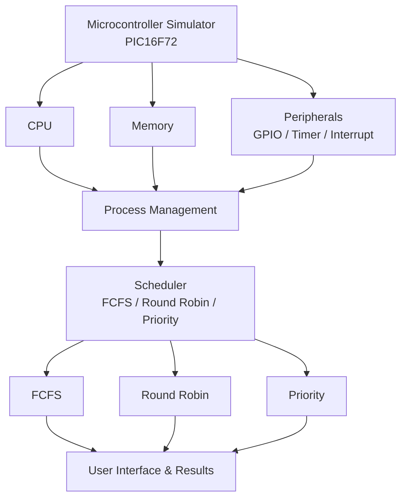

# Team-ThanthrashakthiProject title: Educational 8-bit Microcontroller Simulator with Process scheduling

## Problem Objective: To create a simple simulator for the STC89C52 microcontroller that shows how  instructions are executed, how memory and peripherals works  , and how multiple programs are managed by the CPU using different scheduling methods.

## Problem Statement: Design and implement a Java-based simulator for the STC89C52 8-bit microcontroller that models instruction execution, memory ,stack, GPIO , timer,and interrupts .The simulator will also manage multiple processes using PCB,queues,context switching,and FCFS, round robin,and Priority scheduling algorithms.

## Project scope: The project covers CPU simulation, registers, memory ,stack, peripherals , process management , PCB, ready queue , scheduling , and context switching.

## Microcontroller being simulated:SCT89C52

## Team Members: Venkateshwara U D - 25190152
              Zainaba Fidha K N - 25190155
              Yathiksha U S - 25190153
              Raaif Abdul Haamid - 25190140

## Team responsibilities:
- Venkateshwara U D : CPU and instruction execution
- Zainaba Fidha K N : Memory and stack
- Yathiksha U S : Data structures(DSA)
- Raaif Abdul Haamid : User intertface and context switching

## Selected programming language: JAVA

## Initial System Architecture

## Initial development plan:
## Week 1 – Project Setup
- Finalize project requirements and architecture.
- Set up Java project and GitHub repository.
- Define team responsibilities.
## Week 2 – CPU & Registers
- Implement STC89C52 CPU structure.
- Implement registers, PC, flags, and instruction cycle.
## Week 3 – Instruction Execution
- Implement the required instruction subset.
- Implement instruction lookup and execution.
- Test CPU operations.
## Week 4 – Memory & Stack
- Implement program memory and data memory.
- Implement stack and stack operations.
- Test memory access and stack handling.
## Week 5 – Peripherals
- Implement GPIO operations.
- Implement timer functionality.
- Implement basic interrupt handling.
## Week 6 – Process Management
- Implement processes and PCB.
- Implement process states.
- Implement ready queue and required data structures.
## Week 7 – CPU Scheduling
- Implement FCFS scheduling.
- Implement Round Robin scheduling.
- Implement Priority scheduling.
## Week 8 – Context Switching
- Implement context switching.
- Connect process management with CPU scheduling.
- Test multiple processes.
## Week 9 – User Interface
- Develop the simulator interface.
- Add program loading, run, reset, and single-step features.
- Display CPU, memory, and process states.
## Week 10 – Performance Analysis
- Calculate waiting time.
- Calculate turnaround time and response time.
- Measure context switches and CPU utilization.
## Week 11 – Integration & Testing
- Integrate all modules.
- Perform unit and system testing.
- Fix errors and improve performance.
## Week 12 – Finalization
- Complete documentation and README.
- Prepare demonstrations and test cases.
- Finalize the project and presentation.

