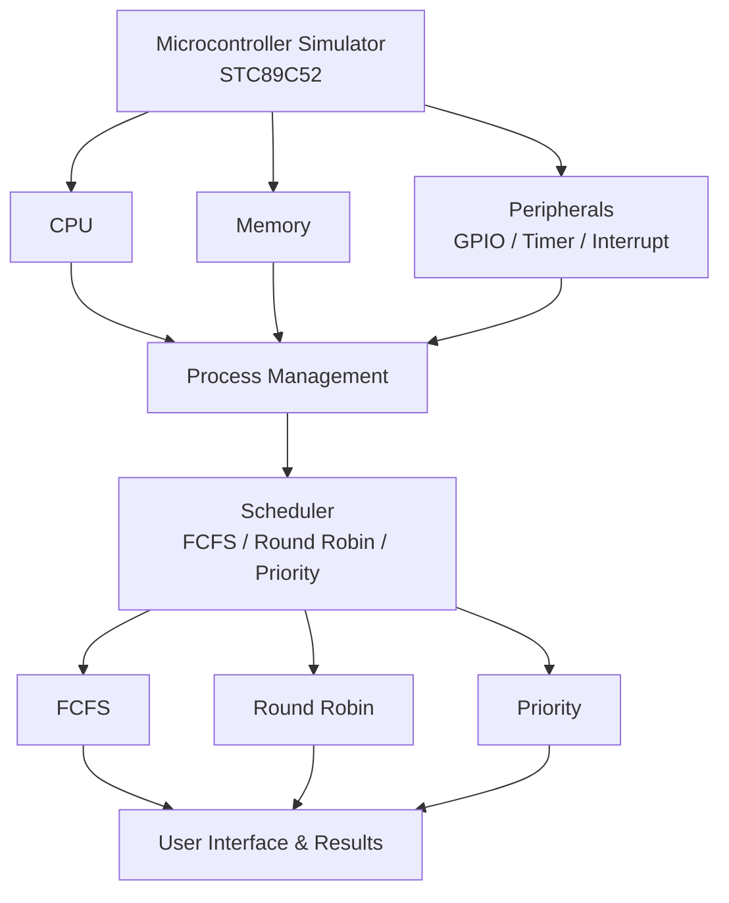

# Team-ThanthrashakthiProject title:
## Educational 8-bit Microcontroller Simulator with Process scheduling

## Problem Objective: To create a simple simulator for the STC89C52 microcontroller that shows how  instructions are executed, how memory and peripherals works  , and how multiple programs are managed by the CPU using different scheduling methods.

## Problem Statement: Design and implement a Java-based simulator for the STC89C52 8-bit microcontroller that models instruction execution, memory ,stack, GPIO , timer,and interrupts .The simulator will also manage multiple processes using PCB,queues,context switching,and FCFS, round robin,and Priority scheduling algorithms.

## Project scope: 
- CPU & Instructions – Simulate CPU registers, flags, PC, and instruction execution.
- Memory & Stack – Manage program memory, data memory, and stack operations.
- Peripherals – Simulate GPIO, timer, and interrupts.
- Process Management – Manage multiple programs using PCB and process states.
- Data Structures – Use stack, queue, circular queue, and instruction lookup table.
- Scheduling – Implement FCFS, Round Robin, and Priority scheduling.
- Context Switching – Switch between processes and save their states.
- User Interface – Support program loading, run, reset, and single-step execution.
- Performance Analysis – Measure waiting time, turnaround time, response time, context switches, and CPU utilization.

## Microcontroller being simulated:SCT89C52

## Team Members:
              Venkateshwara U D - 25190152
              Zainaba Fidha K N - 25190155
              Yathiksha U S - 25190153
              Raaif Abdul Haamid - 25190140

## Team responsibilities:
- Venkateshwara U D : CPU and instruction execution
- Zainaba Fidha K N : Memory and stack
- Yathiksha U S : Data structures(DSA)
- Raaif Abdul Haamid : User intertface and context switching

## Selected programming language: JAVA

## Initial System Architecture

```mermaid
graph TD
    A[Microcontroller Simulator<br/>STC89C52] --> B[CPU]
    A --> C[Memory]
    A --> D[Peripherals<br/>GPIO / Timer / Interrupt]
    B --> E[Process Management]
    C --> E
    D --> E
    E --> F[Scheduler<br/>FCFS / Round Robin / Priority]
    F --> G[FCFS]
    F --> H[Round Robin]
    F --> I[Priority]
    G --> J[User Interface & Results]
    H --> J
    I --> J
```

## Initial development plan:
## Week 1 – Project Setup
- Finalize project requirements and architecture.
- Set up Java project and GitHub repository.
- Define team responsibilities.
## Week 2 – CPU & Registers
- Implement STC89C52 CPU structure.
- Implement registers, PC, flags, and instruction cycle.
## Week 3 – Instruction Execution
- Implement the required instruction subset.
- Implement instruction lookup and execution.
- Test CPU operations.
## Week 4 – Memory & Stack
- Implementation of process
-  UI process , core process and logging
